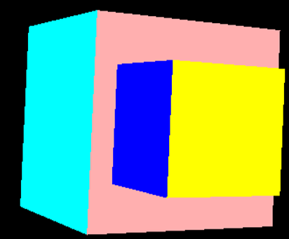

# 3D-Graphic-Engine-Java
This project includes implementation of 3D Ggraphic Engine in Java language.

Table of contents
=================

<!--ts-->
   * [Table of contents](#table-of-contents) 
   * [Description](#description) 
   * [View after start an engine](#view-after-start-an-engine)
   * [Rotation](#rotation)
   * [Moving camera](#moving-camera)
   * [Zoom-in](#zoom-in)
   * [Zoom-out](#zoom-out)
   * [Elimination of hidden elements algorithm](#elimination-of-hidden-elements-algorithm)
   * [Summary](#summary)

<!--te-->

Description
=============

3D Graphic Engine was implemented in Java. There are a lot of options such as zoom, rotation or moving. A programmer can add an objects (in my code there are a cubes), and after run a program - user can use keyboard keys to make a zoom, rotate or move a camera. Project is based mainly on trygonometric transformations.You can find a screenshots of every operation below.

View after start an engine
=========================

Rotation
========

Moving camera
===========

Zoom-in
=========

Zoom-out
========

Elimination of hidden elements algorithm
=================

There was implemented an elimination of hidden elements algorithm. I use a Painter's algorithm. You can see an effect of it on pictures below.

Summary
=====

Project was implemented without any specialistic libraries. There are a lot of mathematical calculations implemented, but it works quite smooth. An Painter algorithm was a great choice for this project - it is not very hard to implement, but it can give good results. 
If any questions, please contact me on my Github @MarcinJ7.
